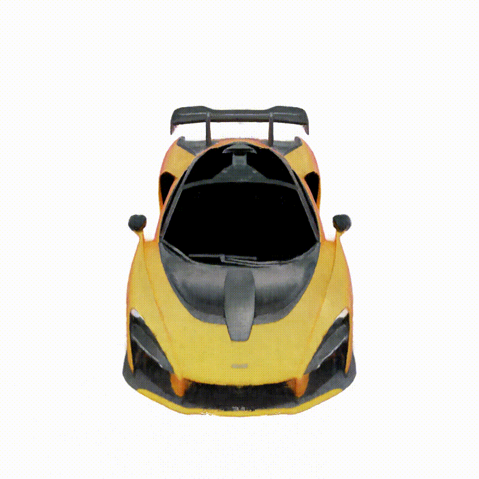

# 1/ Giới thiệu  
  
Ngày nay công nghệ 3D đang được ứng dụng trong rất nhiều lĩnh vực, từ giáo dục, y tế, thiết kế xây dựng hay có thể kể đến lĩnh vực rất được giới trẻ ưa thích- ngành công nghiệp game. Quy trình truyền thống để xây dựng nên các mô hình 3D vốn yêu cầu làm việc trên các phần mềm đồ họa chuyên dụng với các thao tác không thể thiếu từ việc lấy tọa độ các đỉnh vật thể, tô màu, căn chỉnh vị trí, v.v.

Chắc hẳn trong số chúng ta đều từng tưởng tượng đến một quy trình làm việc ít phức tạp hơn, tiện lợi hơn. Ví dụ bạn có thể chụp những bức ảnh 2D của vật thể và để máy tính làm nốt những công việc còn lại để thu được mô hình 3D tương ứng. Và các nghiên cứu trong lĩnh vực **View synthesis and image-based rendering** đã thực sự biến ý tưởng này thành hiện thực.


Bài viết này sẽ hướng dẫn các bạn sử dụng mô hình NERF để mô hình 3D hóa một tập hình ảnh cảnh vật bất kỳ. NERF cho phép chúng ta render hình của cảnh vật từ 1 góc độ mới chưa từng xuất hiện trong dữ liệu ảnh ban đầu. Bằng cách render từ các vị trí liên tiếp nhau, chúng ta có thể thu được khung cảnh động của cảnh vật như trên. Rất thú vị đúng không nào ?!!  

*Các bạn có thể xem qua bài viết giới thiệu ý tưởng NERF tại [đây](http://quoccuonglqd.github.io/quoccuonglqd/blogs/Lý%20thuyết%20NERF)*

# 2/ Chuẩn bị dữ liệu  
[](https://colab.research.google.com/drive/1Q0V_uxwFs3wCiF6DU_cyG8FEidcF3lWr?usp=sharing)

Để sử dụng được mô hình NERF, các hình ảnh đầu vào cần phải đi kèm với các thông số 3D. Các thông số bao gồm vị trí camera, tiêu cự,v.v tương ứng với mỗi bức ảnh. Mô hình NERF sau đó sẽ học cách ánh xạ các thông số 3D này thành các giá trị màu.

Chúng ta sẽ thử nghiệm với 2 cách tạo hình ảnh đầu vào. Đó là hình ảnh synthetic và hình ảnh thực.

## Dữ liệu synthetic (dữ liệu nhân tạo)

Đây là loại hình ảnh thu được từ việc render một mô hình đồ họa hoặc từ một quy trình sinh ảnh nào đó. Loại dữ liệu này thường sẽ dễ dàng để kiểm soát các thông số 3D của mỗi hình ảnh. Trong bài viết sẽ sử dụng hình ảnh render từ mô hình blender.

*Note: Việc sử dụng NERF với tập dữ liệu synthetic có vẻ không có ý nghĩa. Bởi vì khi có trong tay mô hình 3D (ví dụ mô hình blender), ta hoàn toàn có thể thu được hình ảnh từ góc độ bất kỳ. Tuy nhiên, NERF sẽ cho phép ta lưu trữ mô hình dưới một dạng mới thay vì 1 file blender, mesh, voxel, v.v*

**Bước 1: Chuẩn bị file blender**

* Thiết kế hoặc download 1 mô hình 
* Kéo thả sao cho tâm vật thể nằm ở điểm $$(0,0,0)$$
* Chọn vị trí camera bắt được hình ảnh như mong muốn

**Bước 2: Tạo dữ liệu từ file blender**

* Clone code
```bash
git clone https://github.com/quoccuonglqd/NERF-Pipeline
cd NERF-Pipeline
```
* Chỉnh sửa các thông số cần thiết trong file 360_view.py
	* Chỉnh dòng 9 (`VIEWS`) để chọn số hình ảnh render
	* Chỉnh dòng 20 (`fp`) để chọn folder lưu hình ảnh, gọi là $$folder\_dir$$
	* Chỉnh dòng 15 (`RANDOM_VIEWS`) thành False nếu không muốn hình ảnh render ở các góc bất kỳ
	* Chỉnh dòng 16 (`UPPER_VIEWS`) (chỉ có tác dụng khi dòng 15 là True) để quy định render ở chỉ 1 phía của mô hình
* Cài đặt **Blender_api**
```bash
chmod 777 download_blender_api.sh
./download_blender_api.sh
```
* Render hình ảnh
Chạy lệnh sau đây với đường dẫn đến file .blend đã chuẩn bị
```bash
sudo ./blender-2.91.0-linux64/blender -b <your-blender-file> -noaudio -P './GPU.py' -P './360_view.py' -E 'CYCLES' -o // -f 1 -F 'PNG'
```
* Chia tập `train`, `val`, `test`
```bash
mkdir <folder_dir>/train
mkdir <folder_dir>/val
mkdir <folder_dir>/test
python data_split.py --folder_dir <folder_dir>
```

## Dữ liệu ảnh thực

Đây là hình ảnh chụp được trong thế giới thực, thường là từ camera máy ảnh, smartphone, v.v. Thông thường, dữ liệu dạng này không có các thông số 3D tương ứng. Để giải quyết vấn đề này, ta có thể sử dụng COLMAP, một project cho phép ước lượng chính xác các thông số 3D từ tập hình ảnh. 

**Bước 1: Chụp ảnh**

* Tạo một folder chứa dữ liệu, gọi là `scene_dir`
* Tạo thư mục con trong `scene_dir`, đặt tên là `scene_dir/images`
* Lưu hình ảnh chụp được trong folder `images` ở trên

**Bước 2: Tạo dữ liệu**
* Clone code
```bash
git clone https://github.com/quoccuonglqd/NERF-Pipeline
cd NERF-Pipeline
```
* Cài đặt **COLMAP**
```bash
chmod 777 install_colmap.sh
./install_colmap.sh
```
* Thay đường dẫn đến `scene_dir`
```bash
python imgs2poses.py <scene_dir>
```

# 3/ Train NERF với dataset đã tạo

Sau khi đã có data hợp lệ, ta đã có thể huấn luyện mô hình NERF để học cách render ảnh ở các vị trí mới.
Trước tiên chúng ta clone source code NERF từ github

```bash
git clone https://github.com/bmild/nerf
cd nerf
```

Kế tiếp là cài đặt các package cần thiết. Bước này yêu cầu Anaconda đã được cài đặt sẵn.

```bash
conda env create -f environment.yml
conda activate nerf
```

Tạo một file config.txt trong đường dẫn hiện tại. Tại đây ta có thể điều chỉnh các thiết lập về loại data(synthetic hoặc real), đường dẫn và các thông số khác. Nếu đây là lần đầu thử nghiệm, bạn có thể dựa trên 2 file có sẵn config_lego.txt và config_fern.txt  
* Sửa dòng thứ 1 `expname` thành tên dataset
* Sửa dòng thứ 2 `basedir` thành đường dẫn đến thư mục sẽ chứa output
* Sửa dòng thứ 3 `datadir` thành đường dẫn đến thư mục data đã tạo ở phần 2
* Sửa dòng thứ 4 `dataset_type` để lựa chọn loại data

Bắt đầu train, quá trình này sẽ tốn nhiều thời gian. Tốc độ hội tụ tùy thuộc vào loại dữ liệu, kích cỡ hình ảnh, v.v
```bash
python run_nerf.py --config config.txt
```

Hình ảnh, video minh họa cũng như trọng số mô hình sẽ thu được trong thư mục chứa output ở trên




**_Lời kết_**: Vậy là chúng ta đã hoàn thành lần thử nghiệm đầu tiên. Bằng dữ liệu ảnh, ta đã thu được video tương ứng. Trọng số của mô hình NERF cũng được lưu lại và có thể sử dụng để lưu trữ một mô hình 3D thay cho các cách biểu diễn cũ. Mô hình NERF đã được cải tiến trong thơi gian gần đây; source code chính thức cũng đã hỗ trợ thêm nhiều tính năng thú vị thay vì chỉ tạo ra video đổi góc. Những điều này đang chờ chúng ta khám phá.